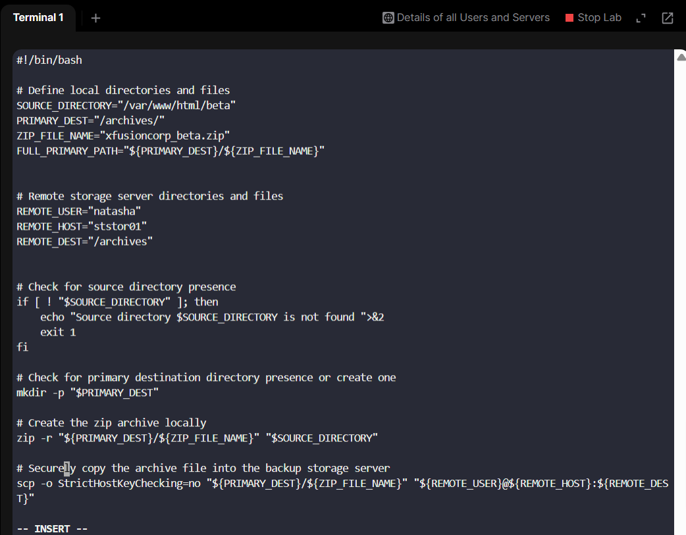
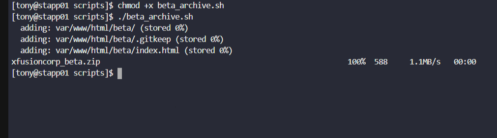
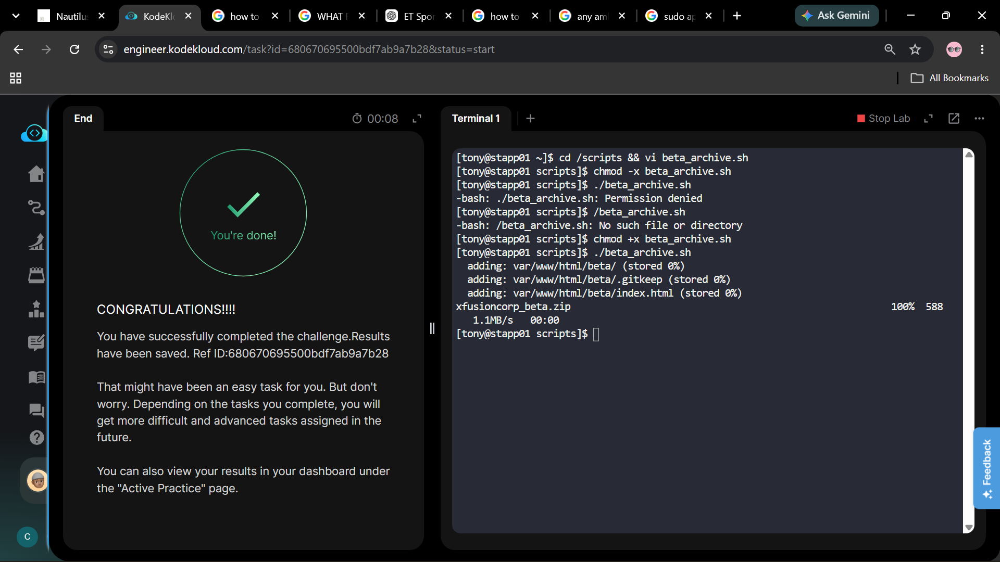

# Day10 Linux Bash Scripts
This task requires to create a bash script on one of the app servers(```stapp01``` in this case) that should accomplish the f/g tasks
1. creates zip archive(named ```xfusioncorp_beta.zip```) of the directory(```/var/www/html/beta```)
2. save the created archive in the ```/archives/``` dirctory on itself.
3. copy the archived file to a backup server, Nautilus Storage Server(```ststr01```)
4. While copying the archive to the remote server, make sure it doesn't ask for password
5. DONOT use sudo inside the script

# Steps done
1. before writing the script on app server ```stapp01``` make sure zip package is installed using ```sudo dnf install zip unzip```(Found to be already installed)


2. Now generate rsa key in the app server ```stapp01``` and then copy it inside ```~/.ssh/authorized_keys``` of the backup storage server ```ststr01``` using the command ```ssh-copy-id natasha@ststr01```


3. Verify passwordless login to the remote storage server ```ststr01```


4. Now create the file and write the script




5. Make the script executable using the command ```chmod +x beta_archive.sh``` so that the respective user can be able to run it. and then execute it using ```./beta_archive.sh```

6. Finally checked for successful implementation.
