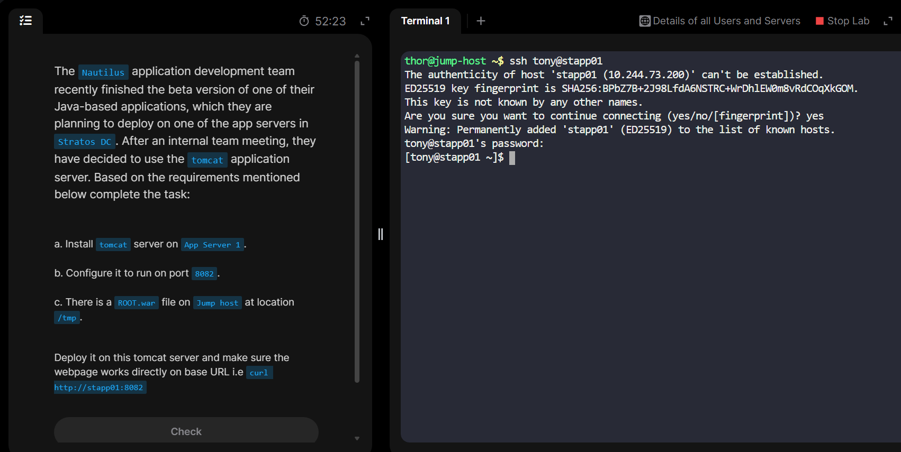
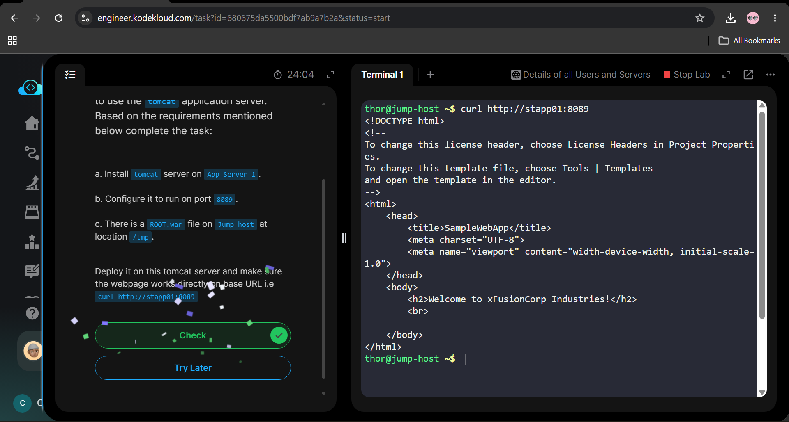

# Day11 Install and Configure Tomcat Server

# What is Tomcat Server?
Apache Tomcat is a free, open-source web server and Java servlet container developed by the Apache Software Foundation. 

# It's key components
1. **Coyote:** The http connector that listens for web requests from clients. Also it can serve basic web pages (Which made it called a "web server")

2. __Catalina:__ The servlet container that manages and executes servlet code. It can handle dynamic backend logics

3. **Jasper:** The JSP(JavaServer Pages) engine that parses and compiles JSP files into servlets.

*The gray line*
The fact that it runs Java code which the regular web servers like Nginx can not do makes it actually an **app server(Servlet Container)**, where as its ability to listen to and handle web requests makes it a web server. 

# The task
The task requires to install and configure tomcat server in one of the app servers(```stapp01```) and also copy a compressed ```.war```(***a ```.war``` file is a web application archive used to bundle a complete Java web application including ```html```, ```css```, ```JavaScript```, ```Java classes```, ```servlets```, and configuration files into a single compressed file***) file from ```jump host``` to the app server, ```stapp01```. and then verify the web page is running on the tomcat server on the configured port on the app server```stapp01```.


# Steps done
1. ssh Login to the app server and install tomcat using the command ```sudo dnf install tomcat tomcat-webapps tomcat-admin-webapps -y``` (the ```-y``` is for ```Yes``` to all confirmation prompts during installation)


2. Come back to the jump host and secure copy the ```.war``` located inside ```/tmp``` to the app server's temporary location ```/tmp``` using ```scp -o StrictHostKeyChecking=no /tmp/ROOT.war tony@stapp01:/tmp/```


3. Change the ```Root.war``` file permission from ```tony``` to ```tomcat``` and verify.


4. Go to the configuration file located in ```/etc/tomcat/server.xml``` and edit to change the default connector port ```8080``` to ```8082``(This connector port basically listens to web requests, handle https, translate requests into Java objects which the app can read and deliver responses from the app.)


5. Verify the installation, configuration and running status using ```sudo systemctl restart tomcat``` and ```sudo systemctl status tomcat```


6. Finally back to ```jump host``` and verify the web page running on the app server ```stapp01``` on port ```8082``` using ```curl http://stapp01:8082```


7. Success check

