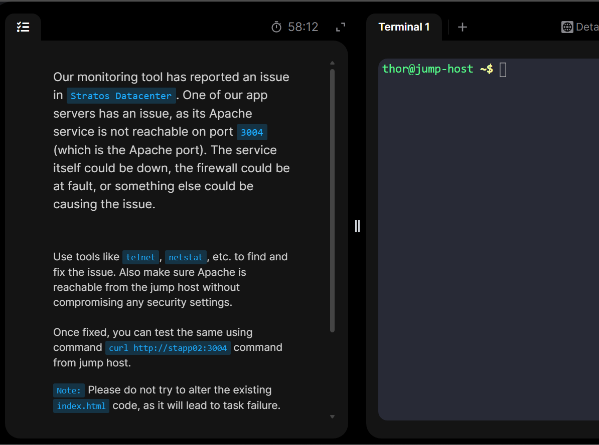
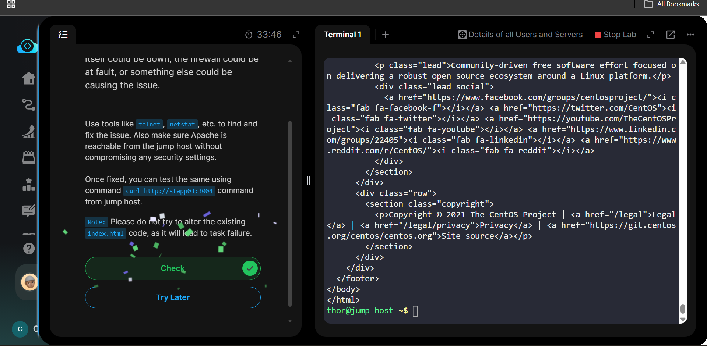

# Day 12: Linux Network Services
This problem states that apache server is not reachable on port 3004 on one of the app servers. problem could be from the service itself, the firewall or something else. We need to also make sure that its reachable from the jump host(firewall rules)


1. To know which server exactly is having the issue, we use ```telnet stapp01 3004```(for all app servers) from the jump host.


2. As can see from the screenshoot above, issue is on ```stapp01```. so login to it and check the status of apache service to look for the cause of the issue ()```sudo systemctl status httpd```


3. Found that the port ```3004``` is already been used by another program


4. Lets go check which program is using this port(```3004```)
```sudo netstat -tulnp | grep :3004```
But then again since ```netstat``` is not found, we install it using ```sudo dnf install net-tools```(CentOs or RHEL) and redo the above check


5. Found out it is being used by the sendmail service.


6. Now we have 3 choices, *Kill the pid of the sendmail*, *Change the port of sendmail*, *let httpd(apache) run in another port*. But since the task specifically told to ```curl``` the appache with port ```3004``` so go with alternative 2(Change the port of sendmail). so we run open the file ```sudo vi /etc/mail/sendmail.cf```, look for the specific line ```DAEMON_OPTIONS``` and change the port from ```3004``` to anything else(in my case ```23```)


7. Now we need to compile the sendmail ```.mc``` file into the ```.cf``` file because the ```.mc```*(Macro Configuration)* file contains the human readable  while the ```.cf```*(Configuration File)* file contains the real machine readable configuration file. While doing this, we need to navigate to the ```/etc/mail``` which is the standard configuration directory for sendmail and also since the compilation requires local dependency files(like ```access```, ```virtusertable```, ```domaintable```) which are located in this specific directory.


8. Again restart the sendmail service (```sudo systemctl restart sendmail```) and make sure it is active and running (```sudo systemctl start).


9. We can further verify that sendmail service is running on port 23 by ```sudo netstat -tulnp | grep sendmail```


10. Now start the ```httpd``` (```apache```) server using ```sudo systemctl start httpd``` and verify the running status.(```sudo systemctl status httpd```)


11. How ever, we can not access apache from jump host using ```curl http://stapp01:3004```, You'll get ```curl: (7) Failed to connect to stapp01 port 3004: No route to host.``` error. Looks like we need to check for its firewall

12. So now try to check for ip lists in the firewall to verify whether or not the port (```3004```) is blocked.
using ```sudo firewall-cmd --list-all``` doesn't work as ```firewall```utility is not installed and active. So we can install it or use ```iptables``` instead. I'll go with the second alternative. (using ```iptables -L -n```.) The ```-L``` flag will enable listing all rules and the ```-n``` will force all the ip addresses and port numbers to display as numbers. *i.e* ip addresses will apear as ```127.0.0.1``` instead of ```localhost``` and port numbers will apear like ``80`` instead of ```http```.


13. As shown in the above picture, port ```3004``` is still rejected as we can not see any rule set to allow ```3004/tcp```. So we need to explicitly mention the rule to permit incoming ```tcp``` request on port ```3004```.
We do that using ```# Allow incoming TCP on port 3004```.
Then again we have to set the rule using ```iptables -I INPUT 1 -p tcp --dport 3004 -j ACCEPT```
## Command breakdown
* ```iptables```: *Invokes the linux IPV4 packet filtering admin utility.*

* ```-I INPUT 1```:
*Inserts(```-I```) the rule into the ```INPUT``` chain at position ```1```, This rule should be at the absolute beginning of the firewall list since linux evaluates ```iptables``` rules sequentially from top to bottom, placing it at position ` ensures that traffic to port ```3004``` is accepted even if a later rule says to block it.*

* ```-dport 3004```:
*Traffic targetting the destination port(```-dport```) number ```3004```.*

* ```-j ACCEPT```:
*THis is the target action. (```-j```(Jump to accept the packet, letting it pass through))*


14. Save the rule permanently using the command ```sudo iptables-save | sudo tee /etc/sysconfig/iptables```
## Command breakdown
* ```iptables-save```:
*Dumps current firewall rules. Then Outputs text to the screen.*

* ``` | (pipe)```:
*Redirects the above command's output and sends the text to next command*

* ```sudo tee```:
*Writes data to files, It bypasses standard permission restrictions and also prints output simultaneously*

* ```etc/sysconfig/iptable```:
*The destination path the above command writes the data to.(Used by RedHat or CentOs)*


14. Once again, verify the ```iptables -L -n``` command to verify successfull application of the rule.(Seen its on the prior position(#1))


15. Now check the server access at the specific port using ```curl http://stapp01:3004``` from the jumphost remote server.


16. Success!



