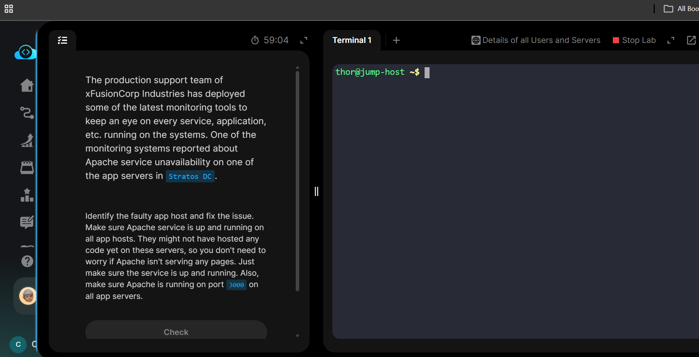

# Day 14: Linux Process Troubleshooting

## The task: 
Today's task mentions the unavailability of apache service on one of the app servers. It then requests to identify and resolve it.


## Lets dive into troubleshooting
## 1. First lets identify on which app server the service is down. (Found out to be on ```stapp01```)


## 2. Lets also check for ```stapp02``` and ```stapp03``` and make sure its running on port ```3000``` as given on the task- instruction.


## 3. Now We identify the issue, as another service is running on the port ```3000```


## 4. So now we need to check which service is running on port ```3000```


## 5. Found out to be ```sendmail``` service. Now we got 3 options. 
* *Kill the ```sendmail``` PID (Process Id) so that we can free the port*
* *Change the port ```sendmail``` is using to some another random unused port* 
    ## OR 
* *Let the ```apache``` run on another port*
### As the task mentions the apache should run on port ```3000```, Lets go with alternative 1(Kill the sendmail process).

## 6. Kill the PID of sendmail


## 7. Now start apache, and verify service running


## Task successfully completed for today!

