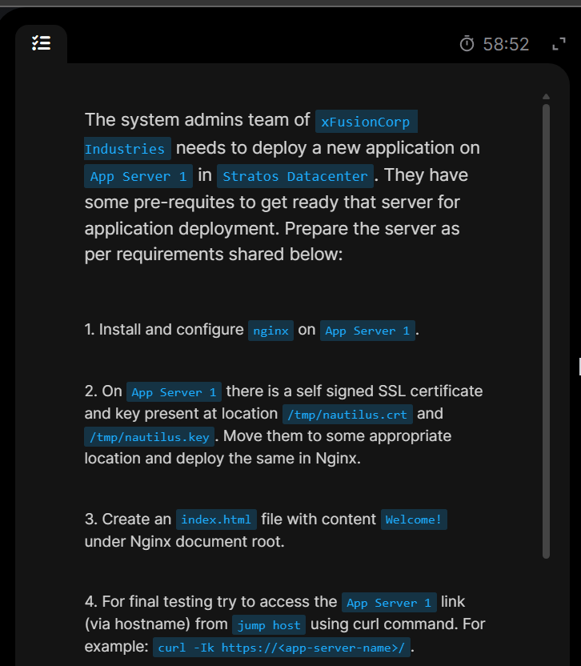

# Day 15: Setup SSL for Nginx

Today's task Day require to install and setup ```ssl``` certificate to ```nginx``` of one of the appservers in ```stratos datacenter```.

## Task overview
* Install and configure ```nginx``` on ```stapp01```
* Move the *self signed certificate* which is inside a temporary location to its appropriate place for secure access.

* Serve a simple html file securely.

* Validate ```https``` access from ```jumphost```


## Step-by-step Execution
1. Login to ```stapp01``` and install ```nginx```.


2. Start, enable and verify nginx status.


3. Move the certificate files to the appropriate secure folder.


4. Put very restrictive file permissions for the secure files.


5. Create a dedicated ```nginx``` configuration for ```SSL``` server.


6. Serve secured html file.


7. Test ```nginx``` for correct configuration and reload it.


8. Finally logour, ```curl``` from the remote host(```jump host```)


9. Finally Successfully completed.👏🎉🥳🎊
