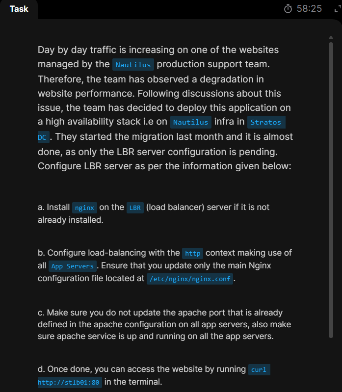

# Day 16: Install and Configure Nginx as an LBR

Today's task states that a degradation in website performance is observed. thus, application is being deployed on a high availability stack. Migration is taking place but only the ```LBR``` server is pending. then it basically requires to..

A. install nginx on lbr(if its not installed)  
B. configure the nginx as per mentioned in the task requirement  
C. Make sure apache is up and running in all app servers and also donot change it's port.  
D. Then finally should be able to access the load balancer from jumphost.


### Steps to solve the task
## Step1: curl to the load balancer server  ```stlb01``` is not working.
```curl http:stlb01:80```


## Step2: Collect ```ip addresses``` info for all app servers


## Step3: Verify apache is running in all app servers and it's port(```8086``` in our case)


## Step4: Verify an already installed nginx, enable, start and verify it on the load balancer(```stlb01```)


## Step5: Open the ```nginx``` configuration file ```/etc/nginx/nginx.conf``` and start editing it.


***Existing ```http``` block,***


***Add the load balancing upstream servers(Backend servers) using the default robin hood algorithm***


***Existing ```server``` block,***


***Add proxy configuration to the upstream backend servers***


## Step6: Now test the nginx configuration for success using ```sudo nginx -t ```


## Step7: Finally back to the jumphost and verify http curl to the load balancer
```curl http://stlb01:80```


## Task done successfully!🎊🎇🎇🎇🎇🎊


