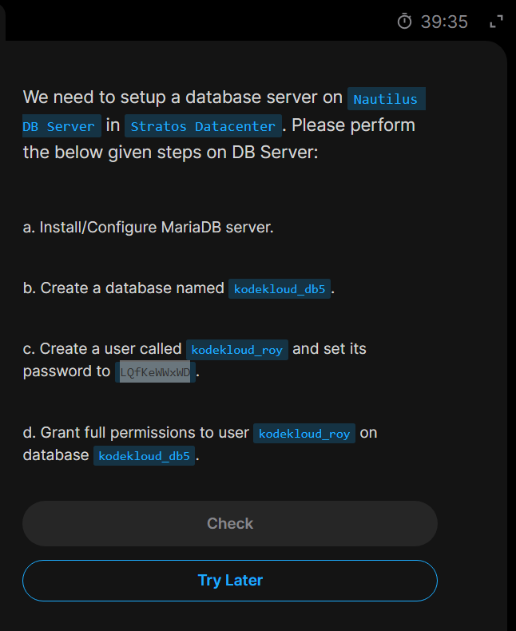

# Day18: Install and configure mariadb on database server

## Today's task requests to perform a database server setup on the `Nautilus DB erver` as per the steps given.



## Implementation

### Step1: Ssh login to the db server(`stdb01`) and install Mariadb server.

`ssh peter@stdb01` and then `sudo dnf install mariadb-server mariadb -y`


### Step2: Start, Enable and Verify status of `mariadb`


### Step3: As database server installation is insecure by default, we need to secure installation using `sudo mariadb-secure-installation`

During the **_secure installation_** procedure, there are on-screen prompts we need to answer like,

- Enter current root password (Press Enter if none)
- Set a strong root password
- Remove anonymous users
- Disallow remote login
- Remove the test database
- Reload previlege tables


### Step4: Before creating the user (`kodekloud_roy`) and the database (`kodekloud_db5`), we must firs login into the database shell as an administrative root user.

`sudo mariadb -u root -p`


### Step6: Now from the `mariadb shell`, we create the database named as in the task requirement.


### Step5: We also create the user with its password with,

`CREATE USER 'username'@'localhost' IDENTIFIED BY 'user_password';`

**_Here we use `username@localhost` as the user is intended to access the db from the same server, if user needs to login from a remote server, we'll need to put the remote server's IP address inplace of `localhost`_**

### Step6: Grant all privileges to the user created on the database

`GRANT ALL PRIVILEGES ON db_name.* TO db_user@localhost`
**_The ```db_name._``` means the database and all the tables under it.\***


### Step6: Now we need to save changes using `FLUSH PRIVILEGES` and then `EXIT`


### Step7: Finally verify logging in to the database created with its respective user using,,

`sudo mariadb -u db_user -p db_name`


Done for today😊😊

