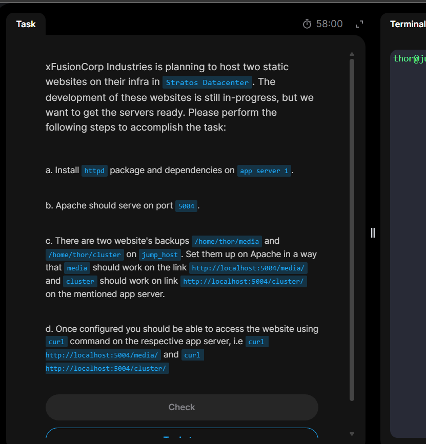

# Day 19: Install and Configure Web Application

## Task Overview:

### The day's task requires deploying two static websites on one of the application servers. First, install and configure Apache HTTP Server on the designated application server. Then, configure Apache to serve each website on the dedicated port specified in the task.

## Solution

### 1. Install apache service package on the specified app server

### 2. Configure the apache to Listen to the dedicated port as per the task specification(`5004` in our case).

### Here we change the default `apache http` serving port (`80`) to `5004`

### 3. Start and enable `httpd` service

### 4. Now, back to the Jump host to Secure copy(`scp`) the files to a temporary folder in the app server. (`scp -R /path/to/local/file ssh remote_user@remote_host:/path/to/remote_server/location`)

**_The "-R" flag here means "Reccurssive" which basically does let us copy all the files and subdirectories under the specified local file path._**

### 5. Back to the app server, the files are located inside the temporary folder location(`/tmp`)

### So we need to move it to the default apache's html files location which is `/var/www/html`

### 6. Verify files located. and their respective users and permissions using the long list(`ls -l`) command.

### 7. As we can see above, files copied from a remote server, by default will have ownership of the user we used to login to this server(`tony` in our case). So now `apache` has no way to serve the files as it doesn't own them. So we need to change the owner of the files from `tony` to `apache`

### 8. Now verify apache is serving the files using its designated port by testing to `curl` to the files location.

### 9. Task is successfully done for today!
