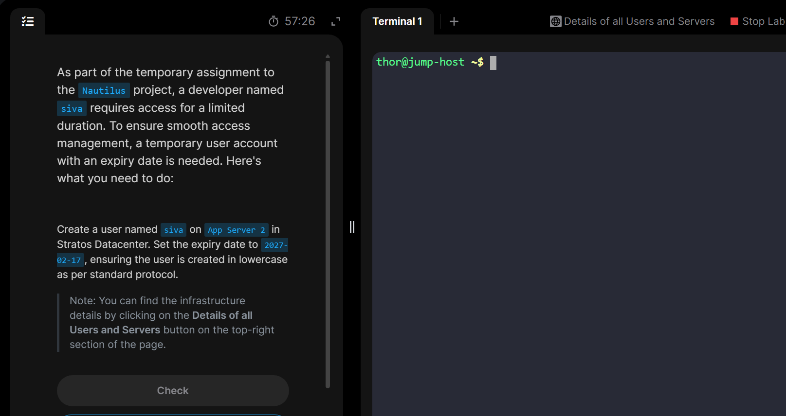

# Day2 Temporary User Setup with Expiry

This task requires to create a temporary user named ```siva``` with limited time of access to one of the app servers(```stapp01```)


# Steps done
1. ssh login to the respective app server(```ssh steve@stapp02```) 
and create a temporary user using the command ```sudo useradd -e 2027-02-17 -m siva```
 *the flags* ```-e```: to set expiry date and ```-m``` to create a homepage for the user.


2. Verify user creation using
* ```grep siva /etc/passwd```: which looks for something like ```siva``` in ```/etc/passwd``` which is a directory where users are located.

* ```sudo chage -l silva```: The ```chage``` meaning *change age* is used to view info and manage accounts expiration and account lifetime settings. and the ```-l``` stands for listing those.

