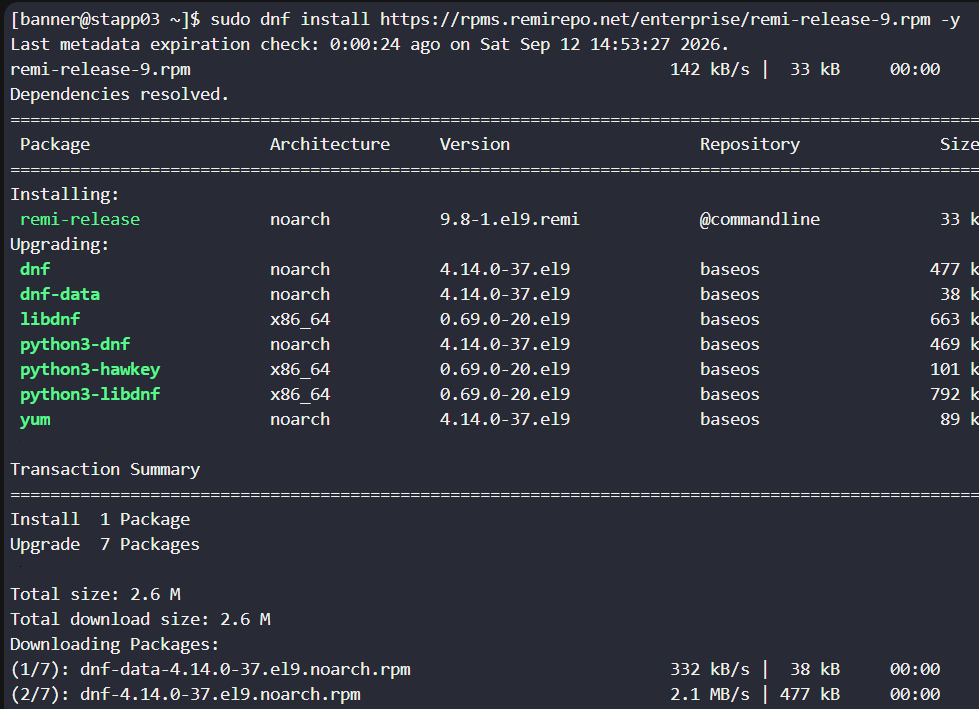
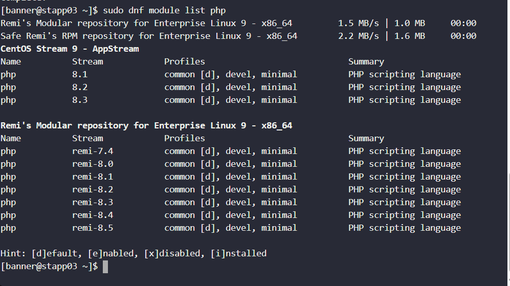
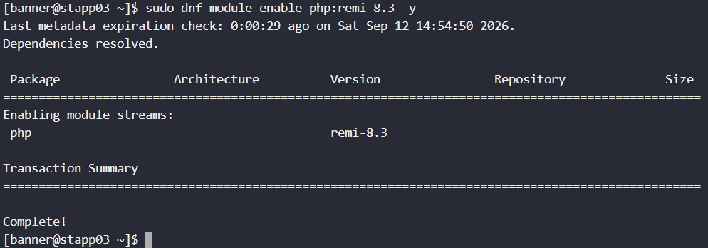

# Day 20: Configure Nginx + PHP-FPM Using Unix Sock

## Highlights of today's task

1. Install nginx on `stapp03`(App server3), and configure it to listen on port given(`8092`) in our case, and set document root to `/var/www/html`
2. Install `php-fpm` version, `v-8.2`
3. The `php-fpm` must run via socket given (`/var/run/php-fpm/default.sock`)
4. `php-fpm` and `nginx` must be integrated properly.
5. Finally `curl http://stapp03:8092` should work from the jump host.
   

## Starter

### What is `php-fpm`?

**_`php-fpm`(PHP FastCGI Process Manager) is an alternative to `FastCGI` or FAST COMMON GATEWAY INTERFACE (which is a protocol that allows web servers like NGINX or Apache to talk to external software like `PHP`, `Python`, or `Ruby` to generate dynamic web pages), high-performance process manager for php used to handle web traffic efficiently._**

#### 1. Lets get into `stapp03`, install `nginx`, start and enable it.


#### 2. Then we open the `nginx` config file for the required configuration setup.


#### 3. Existing nginx config server directives:


#### 4. Edit the config file to listen to the required port, and add a separate `server` block inside the `http{}` block.

```
server {
    listen 8093;
    server_name stapp03;

    root /var/www/html;
    index index.php index.html;

    location / {
        try_files $uri $uri/ =404;
    }

    location ~ \.php$ {
        include fastcgi_params;
        fastcgi_pass unix:/var/run/php-fpm/default.sock;
        fastcgi_index index.php;
        fastcgi_param SCRIPT_FILENAME $document_root$fastcgi_script_name;
    }
}
```

#### How does the above `server` block serve a website?

#### The most important thing is to understand the flow:

##### Browser/Jump Host ---> Any http request ---> handeled by `Nginx` port `8093` ---> if `php` request, ---> Will be handeled by `PHP-FPM` socket. then ---> `/var/run/php-fpm/default.sock`(PHP-FPM's communication socket) will execute `PHP`s and then ---> Response.

</br>


#### `root /var/www/html/`:

Tells `Nginx` that the website's files are located under `/var/www/html`.

**_Suppose we have `/var/www/html/index.php`, then `http://stapp03:8093/index.php` maps to `/var/www/html/index.php`._**

#### `index index.php index.html`:

Tells the Nginx what files to look for when a user requests a directory. For eg, if user sends requst to `curl http://stapp03:8093/`, `Nginx` will look for `/var/www/html/index.php` file first, if not found, will again look for `/var/www/html/index.html` file to serve. so the order matters here.

####

```
location /{
   try_files $uri $uri/ =404;
   }
```

This acts as the default "catch-all" routing mechanism for incoming web requests. Since every valid `URL` path starts wi'th a forward slash(`/`), any request that doesn't match a more specific location block will fall back to this one.\
`$uri` represents a requested path and
`$uri/` represents a directory
if they donot exist for a request,`Nginx` will return `400, Not found`

#### `include fastcgi_params;`:

This loads a predefind configuration file containing FastCGI parameters

#### `fastcgi_pass`:

This is the bridge b/n `Nginx` and `PHP-FPM`
`fastcgi_pass unix:/var/run/php-fpm/default.sock;`\ This line has to agree with our `PHP-FPM` configuration which has this line:\

`listen = /var/run/php-fpm/default.sock`\
 We can think of it as a private communicatin channel b\n `Ngix` and `PHP-FPM`.

#### `fastcgi_index index.php;`:

This specifies the default `FastCGI` index file as `index.php`.

#### `fastcgi_param SCRIPT_FILENAME`:

`PHP-FPM`needs to know which file exactly it should execute. so, according to `fastcgi_param SCRIPT_FILENAME $document_root$fastcgi_script_name;`\

For eg if request is `http://stapp03:8096/index.php`, the `$document_root` == `/var/www/html` and the `$SCRIPT_FILENAME` === `index.php`. so finally `PHP-FPM` will execute `/var/www/html/index.php`.

#### 5. Test the `Nginx` for syntax okay and configuration success, and then restart.


#### 6. Install Unix extra packages(`epel`)


#### 7. Download and install Remi repository configuration.



**_Remi is a third-party repository that provides newer `PHP` versions._**

#### 8. We can see and list the Remi downloaded newest versions of php using

`sudo dnf module list php`


#### 9. Enable ``PHP 8.3` from Remi

`sudo dnf module enable php:remi-8.2 -y`


#### 10. Install a more complete `PHP-FPM` environment.

`sudo dnf install php-fpm php php-cli php-common php-mysqlnd php-gd php-xml php-mbstring php-pdo php-opcache -y`


- php-fpm == Nginx<>PHP
- php-cli == Terminal php
- php-mysqlnd == MySQL/mariaDB
- php-gd == images processing
- php-xml == XML processing
- php-mbstring == handles UTF-8/multibyte texts
- php-pdo == databases
- php-opacache == performance(By caching compiled php code)

#### 11. We can verify the installed php-version.

`php -v`


#### 12. Open the PHP-FPM config file


#### Existing:


#### 13. Edit the `php-fpm` cofig file to use the unix socket `/var/run/php-fpm/default.sock` and to communicate with (tobe handeled by) `Nginx`.


#### 14. Ensure the parent directory exists (Create one if it doesn't) and necessary permissions.


#### 15. Now enable, start and verify running status of `php-fpm`.


#### 16. Once again test and verify the status of Nginx

`sudo nginx -t` and
`sudo systemctl status nginx`

#### 17. Finally from the jumphost, verify access.


#### 18. Today's task was a bit tricky. Done successfully! 🎊🎊😊😊😊😊🎊🎊


