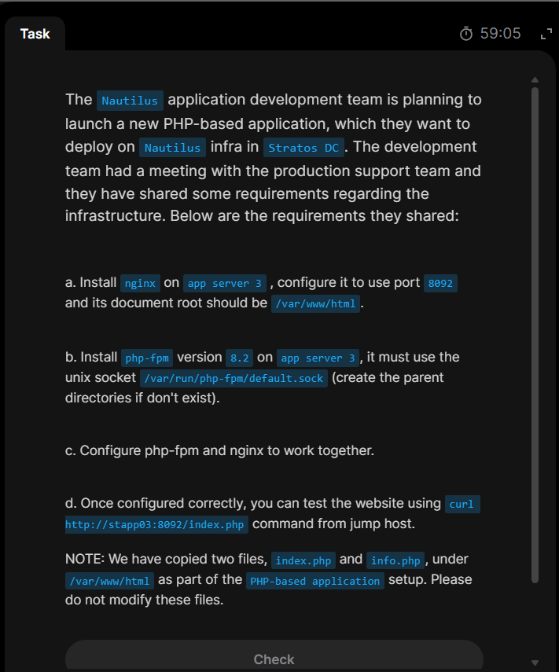

# Day 20: Configure Nginx + PHP-FPM Using Unix Sock

## Highlights of today's task

1. Install nginx on `stapp03`(App server3), and configure it to listen on port given(`8092`) in our case, and set document root to `/var/www/html`
2. Install `php-fpm` version, `v-8.2`
3. The `php-fpm` must run via socket given (`/var/run/php-fpm/default.sock`)
4. `php-fpm` and `nginx` must be integrated properly.
5. Finally `curl http://stapp03:8092` should work from the jump host.
   

## Starter

### What is `php-fpm`?

**_`php-fpm`(PHP FastCGI Process Manager) is an alternative to `FastCGI` or FAST COMMON GATEWAY INTERFACE (which is a protocol that allows web servers like NGINX or Apache to talk to external software like `PHP`, `Python`, or `Ruby` to generate dynamic web pages), high-performance process manager for php used to handle web traffic efficiently._**

#### 1. Lets get into `stapp03`, install `nginx`, start and enable it.


#### 2. Then we open the `nginx` config file for the required configuration setup.


#### 3. Existing nginx config server directives:


#### 4. Edit the config file to listen to the required port, and add a separate `server` block inside the `http{}` block.

```
server {
    listen 8096;
    server_name stapp03;

    root /var/www/html;
    index index.php index.html;

    location / {
        try_files $uri $uri/ =404;
    }

    location ~ \.php$ {
        include fastcgi_params;
        fastcgi_pass unix:/var/run/php-fpm/default.sock;
        fastcgi_index index.php;
        fastcgi_param SCRIPT_FILENAME $document_root$fastcgi_script_name;
    }
}
```
