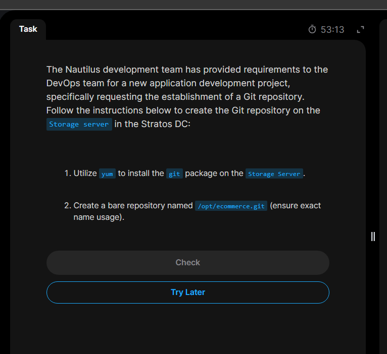

# Day 21: Set Up Git Repository on Storage Server

### Today's task is to install git on the storage server and create a bare repository named `/opt/ecommerce.git` in it so that it will be ready for remote collaboration.

### 1. We start by `ssh login` to the storage server, then install `git` packages using `yum`

`sudo yum install git -y`

### 2. Verify installation

`git --version`

### 3. Create a bare repository and initialize a bare repo in it (`.git`)

### What is bare repository and why is it used for?

**_A bare repository is a central repository that contains only the version control history and no working directory (no editable project files). It is used on a remote server as a remote hub where different developers or team members collaborate(push and pull code.) It only contains the `.git` tracking data (like commits, hooks and branches) that Git uses to manage our project._**

### Why is it used for?

**_If we push code to a standard repository, Git gets confused because the files on the server's screen wouldn't match the new history we just pushed. But bare repository avoids this conflict,It stores any code pushed from team members but it isn't readable. It just stores the history and waits for other developers to pull in down._**

so to implement this step:

- first we create the directory:\
  `sudo mkdir /opt/ecommerce.git`
- and then initialize an empty git repository in it:\
  `sudo git init --bare`

#### 4. Done for today!👌👌👌

