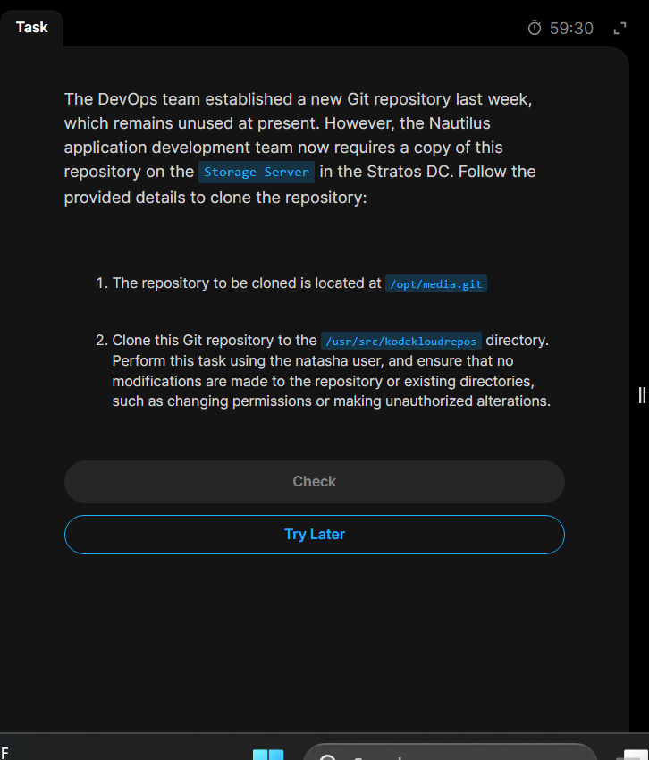
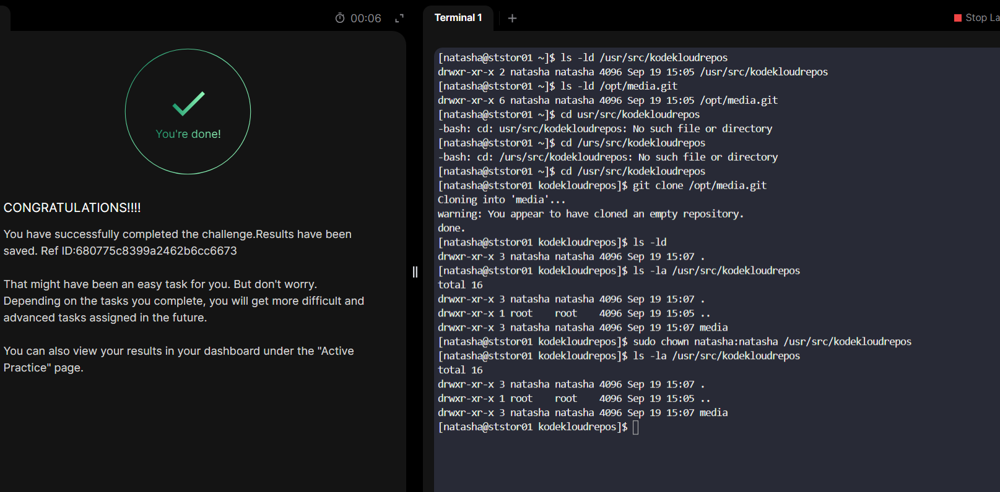

# Day22: Clone Git Repository on Storage Server

## The day's task involves cloning an existing Git repository from the Storage Server into the specified repository directory while ensuring the clone is performed under the correct user context.

### Step1: `ssh login` to the storage server (`ststor01`)

### Step2: Change into the specified repository directory. (`cd /usr/src/kodekloudrepos`)

### Step3: Clone the repository here (`git clone opt/media.git`)

### Done!

