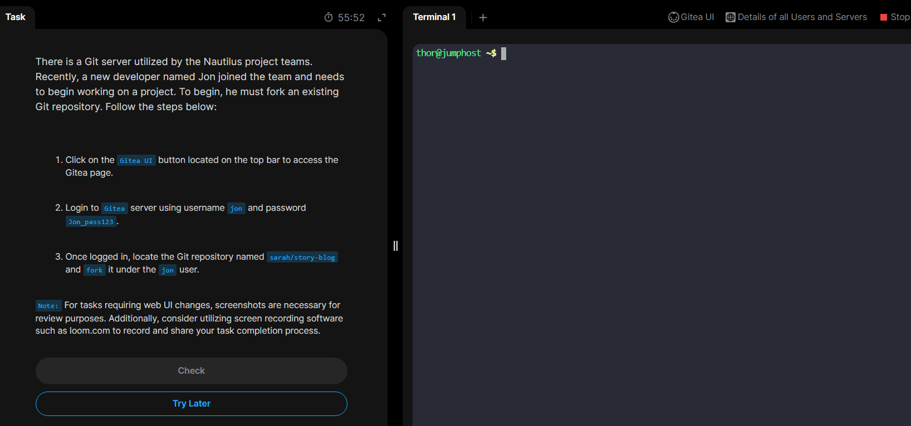
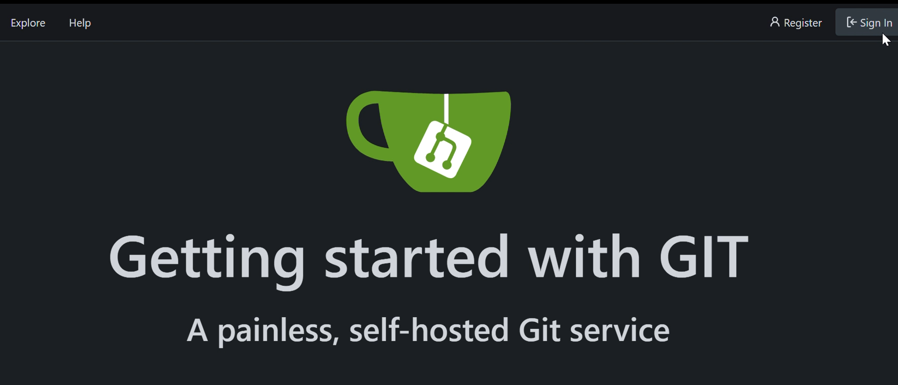

# Day23: Fork a Git Repository

## Task Preview:

## Steps

### 1. Look into the GitUI, signin with the given username `jon` and password.

### 2. Explore repositories (find the specific one requested.)

### 3. Fork the repository, use the username `jon`

### 4. Verify the forked repo from `jon`'s page.

## Done! 😋
