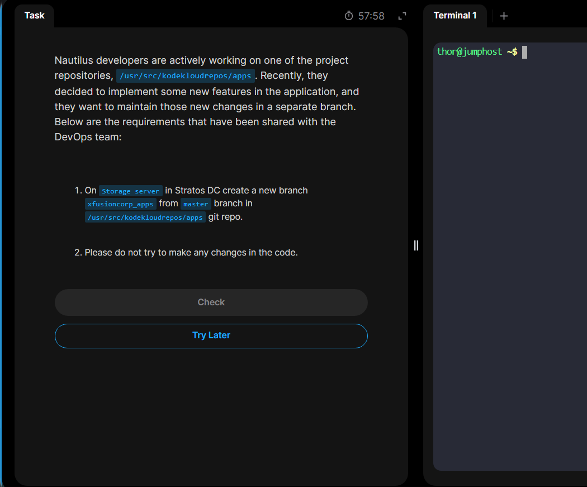

# Day 24: Git Create Branches

Today's challenge focuses on creating `git` branch.

## Task overview:

## Step1: Login to the storage server `ststor01`, then navigate to the `git` repo.

## Step2: Create the branch, then verify

## Finito😁😁

