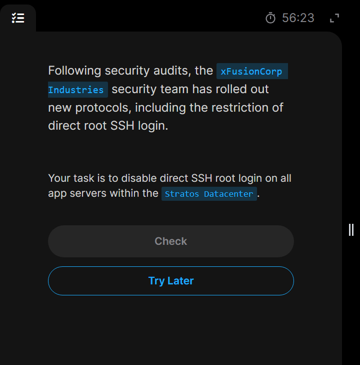

# Day 3: Secure Root SSH Access
Direct SSH root login means connecting remotely to a Linux server via SSH using the absolute administrator account (```root```) right from the start. Instead of logging in as a standard user and switching to administrative privileges later, we run a command like ```ssh root@your_server_ip``` to gain immediate, unrestricted access

## Task


## Steps done
1. ssh Login to each app servers(eg ```stapp01```) and edit the ssh configuration file located in ```/etc/ssh/sshd_config```, change the ```PermitRootLogin``` from ```yes``` to ```no```.


2. Can recheck the script using ```grep -i "RootLoginPermit" /etc/ssh/sshd_config``` as follows:


3. Then restart the ```sshd``` after the config file change


4. Do same for all the remaining app servers(```stapp02``` and ```stapp03```)


5. Finally we can see root login permission denied from a remote server(```jump host```) in this case. 


6. Success.