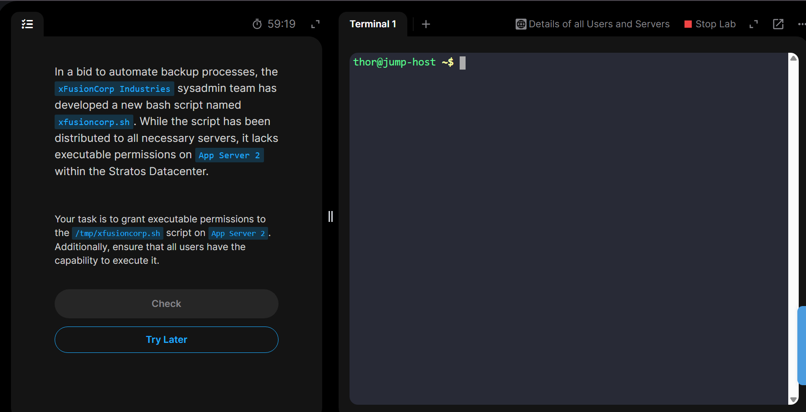

# Day 4: Script Execution Permissions

The day's task is to put the necessary exebutable permissions for a shell script file found in ```/tmp/xfusioncorp.sh```.
Task detail: 

## Steps

### Step1: Check the file permission using long list (```ls -l```)


### Step2: Change the file permission using ```a+rx /tmp/xfusioncorp.sh```
***What it means***:
```a```== ***for all users***
```+rx``` == ***add permission to read and execute the file***

## Then verify the execusion using ```/tmp/xfusioncorp.sh```


## Done👌
