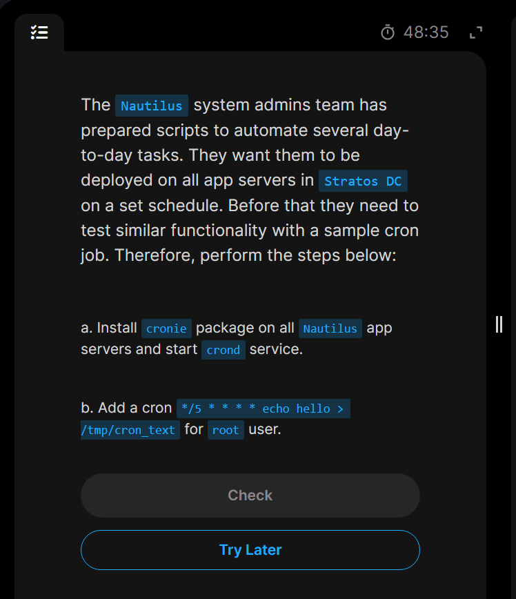

# Day 6: Create a Cron Job

The day's task requests to install `cronie` package on all app servers(`stapp01`, `stapp02`, and `stapp03`) then to start `crond` service and add a `cron` for the root user.

## What is **_Cronie_** and what is it used for?

`cronie` **_is the standard cron daemon package_** used in Linux distributions like `CentOS`, `RHEL` and `Rocky Linux`.
It is a time-based job scheduler that runs in the background(`crond`) to execute commands, scripts, or tasks automatically at specific times, dates, or intervals.

`Cronie` is used to automate repititive system maintenance and administrative tasks like,

- Running daily or weekly **_system backups_**,
- **_Rotating log files_** to prevent disk space from filling up.
- **_Syncing databases_** or clearing out temporary caches.
- Automating routing **_software updates_** or health checks.

## How it works:

The background service (`crond`) constantly wakesup every minute to check configuration files called (`crontabs` OR `crontables`). If the current time matches an entry in a `crontab`, `crond` executes th3e associated command.

## Crontab Syntax:

Tasks are defined using a 5-field time format, followed by the command;
.---------------- minute (0 - 59)
| .------------- hour (0 - 23)

| | .---------- day of month (1 - 31)
| | | .------- month (1 - 12)
| | | | .---- day of week (0 - 6) (Sunday to Saturday)
| | | | |

- - - - - /path/to/command

## Now lets dive into the task implementation.

### Step1: ssh login to the app servers and install `cronie` package.

### Step2: Start, enable and verify status of the `crond` background service.

### Step3: Open a configuration file `crontab` for the `root` user to edit(the `-e` flag is to edit the crontab)

### Step4: And then edit the file by adding the line `*/5 * * * * echo hello > /tmp/cron_text`, save and close.

### Step5: Also another implementation, we can change to `root` user at first (`sudo -i`),

### And then directly loop the echo command into the `crontab` of the `root` user.

`echo "*/5 * * * * echo hello > /tmp/cron_text" | crontab -`
**_The "-" sign here with "crontab -" tells the command to read the cron configuration directly from the standard input(`stdin`) instead of opening an editor_**

- So accordingly with the above explanation in **Crontab Syntax**, The command basically does this:
  - _/5 (Minute): The /5 means every 5 minutes (e.g., at 12:00, 12:05, 12:10). The asterisk _ means "every", and the slash step modifier breaks it down into increments.

  - \*(Hour): Every hour of the day.

  - \*(Day of Month): Every day of the month.

  - \*(Month): Every month of the year.

  - \*(Day of Week): Every day of the week

So the `echo hello > /tmp/cron_text` command writes the word "hello" into a file named `cron_text` inside the `/tmp` folder. The `>` symbol overwrites the file everytime it runs.

### Step6: Then verify `crontab` created by listing (`crontab -l`)

### Step7: Do it for all app servers.

And finally done😊😊

