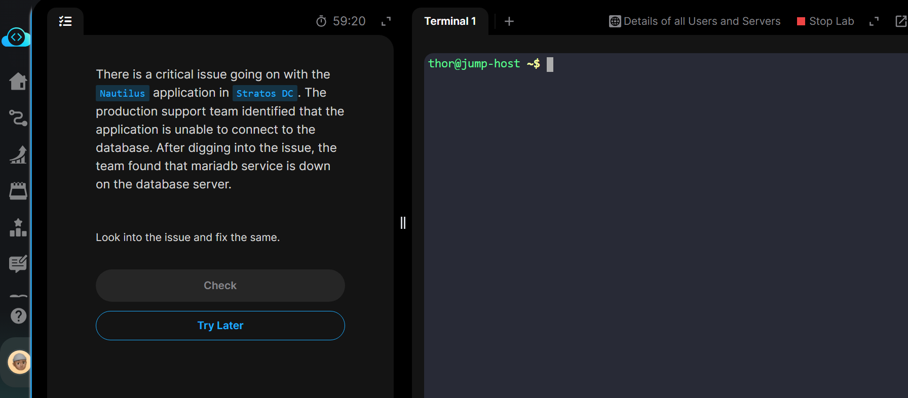
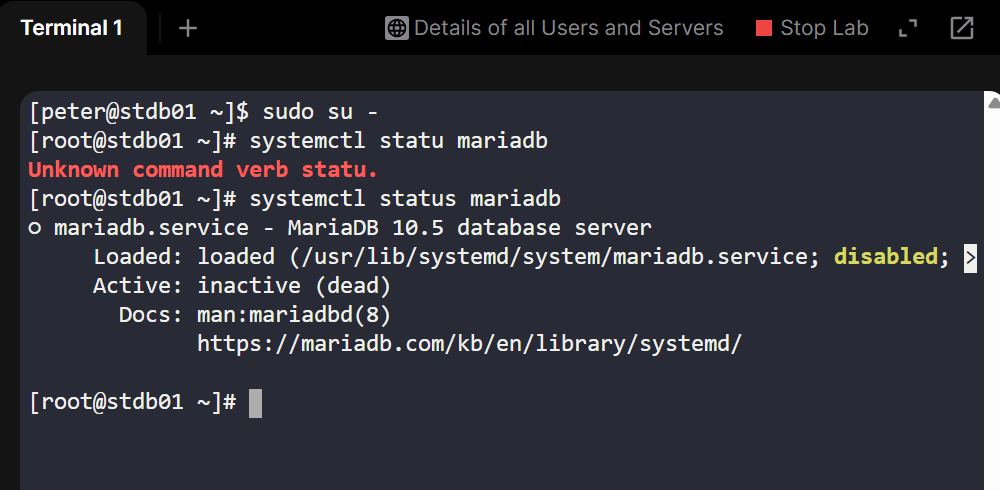
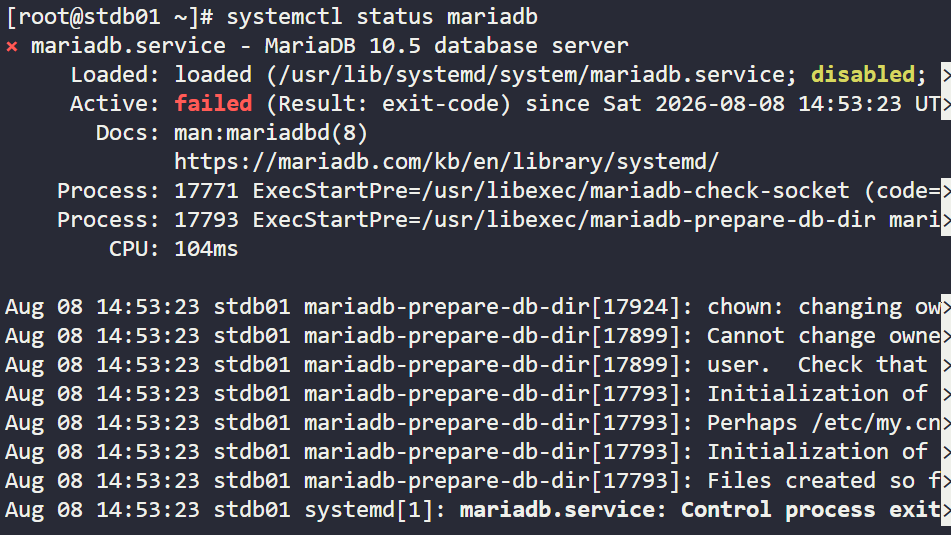

# Day9 Troubleshoot Mariadb

This task requires to fix a dead mariadb service on the database server(stdb01), which couldn't connect to the app server.


## Steps done
1. Login to the database server (```stdb01```) with the provided username (```peter```) and password using ssh.
2. Grant a supersuser login using the command ```sudo su -```

3. Check for mariadb status using the command ```systemctl status mariadb```

4. After confirming system is down and all the failures, check for error log using the command ```ls -lah````(list all files and directories) ```/var/log/mariadb/mariadb.log```

5. After finding out the issue(```/var/lib/log```) has and empty ```sqld``` directory before initialization so reinitializing fails coz all the ```/var/lib/mysql``` directories should be created during initialization,
.
6. Rename the ```/var/lib/mysqld``` folder to ```/var/lib/mysql```

7 Again try to start the server using ```systemctl start mariadb```

8. Verify successful start (```systemctl satatus mariadb```)

